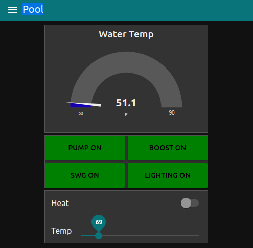
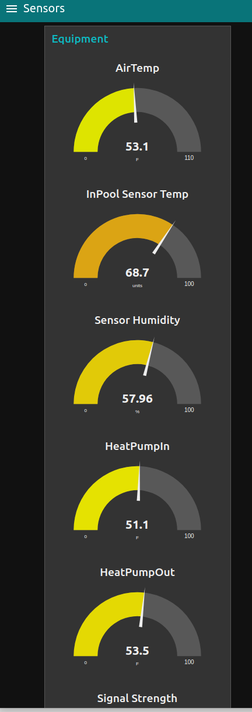
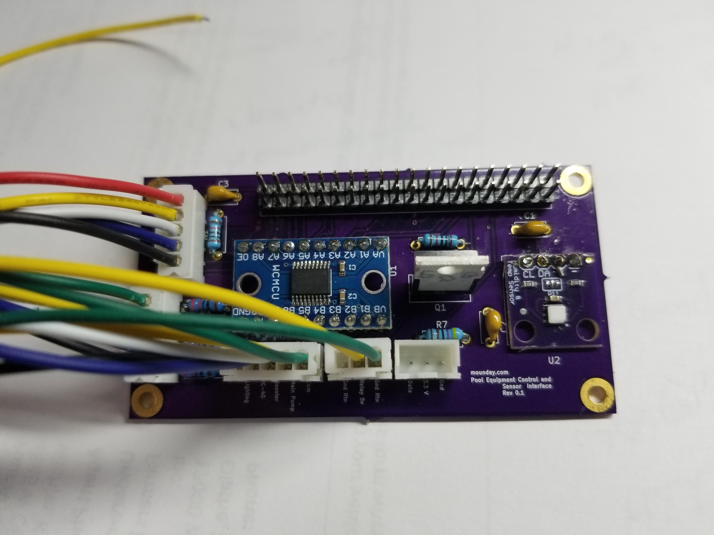
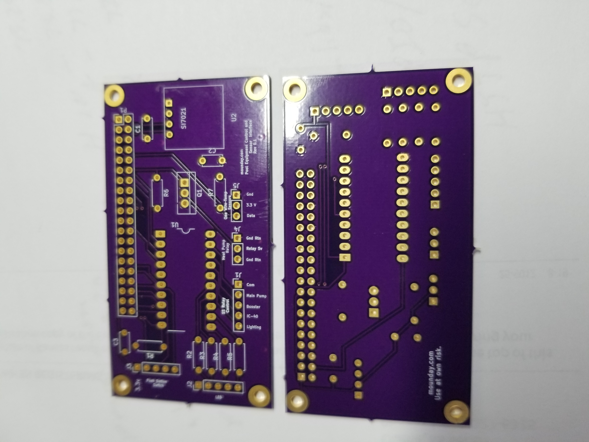

# Simple Pool Equipment Control
## Features:
- Main Pump control
- Booster Pump on/off
- Heat Pump on/off temperature set
- Sanitizer on/off
- Node Red user interface.

## Pool Equipment Control Web Interface
The interface to the pool equipment if provided by a NodeRed application that is
accessable with a Web browser. The URL is typically 
`http://<pool-gateway-name>`

The main screen shows the water temperature and presents the power on/off buttons for
the main pump, booster pump, sanitizer(SWG), and pool lighting. In addition there
is a slider to set the temperature setting for the heat pump and a heat pump on/off
slider. 

Additional pool sensors reading may be accessed by selecting the Sensors pull-down menu item:

The Schedule pull-down menu item presents the scheduling fill-in screen:

## Generalized configuration of sensors and equpment.
Written in C++17 
Boost ASIO and Property Tree.

To build see the README in the PoolControllRPi directory.

## Sensor and Relay connection Interface

